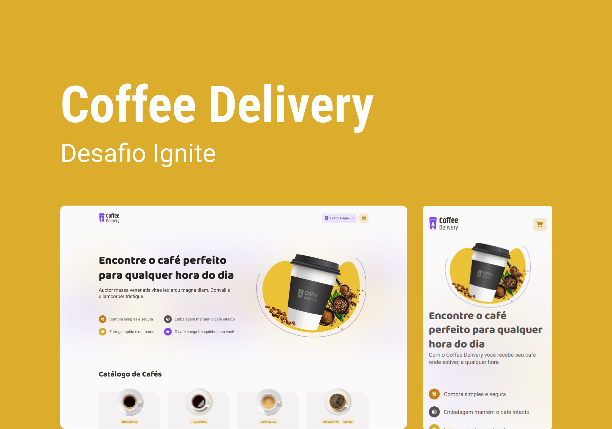

<p align="center">
    
</p>

## 🚀 Tecnologias

Esse projeto foi desenvolvido com as seguintes tecnologias:

- Vite
- Typescript
- Radix UI
- React Hook Form
- Styled Components
- Json Server

## 💻 Projeto

Coffee Delivery é uma aplicação para gerenciar um carrinho de compras de uma cafeteria fictícia, que contém as seguintes funcionalidades: 

- Listagem de produtos (cafés) disponíveis para compra
- Adicionar uma quantidade específicas de itens no carrinho
- Aumentar ou remover a quantidade de itens no carrinho
- Formulário para o usuário preencher o seu endereço
- Exibir o total de itens no carrinho no Header
- Exibir o valor total da soma de itens no carrinho multiplicados pelo valor

### Iniciar a aplicação

Após clonar o projeto e instalar todas as dependências execute os seguintes comandos no terminal:

Para rodar aplicação

```bash
npm run dev
```

Iniciar o servidor

```bash
npm run dev:server
```


## :memo: Licença

Esse projeto está sob a licença MIT. Veja o arquivo [LICENSE](LICENSE.md) para mais detalhes.